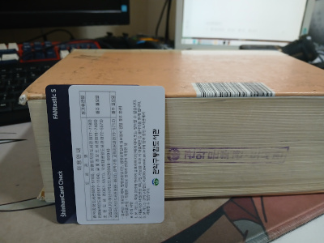

# 카라마조프 가의 형제들

* 제목: [카라마조프 가의 형제들](https://www.aladin.co.kr/shop/wproduct.aspx?ItemId=209588030)
* 저자: [표도르 미하일로비치 도스토옙스키](https://en.wikipedia.org/wiki/Fyodor_Dostoevsky)
* 번역: [김연경](https://www.yes24.com/product/author/132610)
* 출판사: [민음사](https://minumsa.com/)
* 발행일: 2019-09-20 (2판 1쇄)
* ISBN 978-89-374-4379-4
* 하드커버 1권짜리 판본. 1,456 페이지

### 원제

* (ru, 원제) Бра́тья Карама́зовы
* (en) The Brothers Karamazov
* (ko) 카라마조프 가의 형제들

## 소개

## 감상

---
# AI와 토론

* Model: Gemini 2.5 Pro
* 기간: 2025-09-22 ~ 2025-09-25

독서 중 AI와 토론한 내용을 첨부합니다. AI의 답변이 100% 정확하지는 않으므로 참고로만 사용하시기 바랍니다.

---
## 질문

> 큰맘 먹고 카라마조프의 형제들을 빌려 왔어. 첫 페이지에 등장인물이 나오는데
> 
> * 첫째 부인: 아젤라이다 이바노브나 미우소바
> * 둘째 부인: 소피아 이바노브나
> 
> 아젤라이다와 소피아는 미들네임(성)이 같은데 친척인가?

아주 좋은 질문입니다! 많은 분들이 러시아 문학을 처음 읽을 때 헷갈려 하는 부분이죠.

결론부터 말씀드리면, **아델라이다와 소피아는 친척이 아닙니다.**

두 사람의 이름에 들어 있는 '이바노브나(Ивановна)'는 우리가 생각하는 '성(Surname)'이나 '미들네임(Middle name)'이 아니라 **부칭(Отчество)**이기 때문입니다.

### 러시아의 이름 구조: 부칭(Отчество)

러시아 사람들의 이름은 보통 세 부분으로 이루어집니다.

1. **이름 (Имя):** 개인의 고유한 이름 (예: 아델라이다, 소피아)
2. **부칭 (Отчество):** **'아버지의 이름'에서 파생된 이름.**
3. **성 (Фамилия):** 가문의 성 (예: 미우소바)

'이바노브나'는 **'이반(Иван)의 딸'**이라는 뜻입니다.

- 아버지가 '이반'이면, 아들은 **이바노비치(Иванович)**
- 아버지가 '이반'이면, 딸은 **이바노브나(Ивановна)**

따라서 아델라이다 이바노브나와 소피아 이바노브나는 **두 사람 모두 아버지의 이름이 '이반'일 뿐, 서로 자매이거나 친척 관계라는 뜻은 아닙니다.** '이반'은 러시아에서 매우 흔한 이름이므로, 우연히 아버지 이름이 같았을 가능성이 높습니다.

- **첫째 부인:** 아델라이다 **이바노브나** 미우소바 (Adelaida **Ivanovna** Miusova)
    - 이름: 아델라이다
    - 부칭: 이반의 딸
    - 성: 미우소바
- **둘째 부인:** 소피아 **이바노브나** (Sofia **Ivanovna**)
    - 이름: 소피아
    - 부칭: 이반의 딸
    - (결혼 전 성은 소설에서 크게 중요하게 다루어지지 않습니다.)

'카라마조프가의 형제들'은 정말 멋진 선택입니다! 이 부칭 개념을 알고 계시면 앞으로 등장인물들의 관계를 파악하는 데 큰 도움이 될 겁니다. 즐거운 독서 되시길 바랍니다!

---
## 질문

> 그러면 Johanson, Johandottir 같은 의미인거네. 그래서 그런지 '이바노비치'라는 이름을 정말 많이 들어본 것 같아.

정확히 맞습니다! 완벽하게 이해하셨네요.

**Johanson, Johansdottir** 와 **이바노비치, 이바노브나**는 같은 뿌리를 가진, **부칭(patronymic)** 시스템의 훌륭한 예시입니다.

- **-son / -dottir:** 스칸디나비아 (특히 아이슬란드) 지역에서 흔히 볼 수 있으며, 각각 '아들(son)'과 '딸(dottir)'을 의미합니다.
    - **Johanson:** '요한(Johan)의 아들'
    - **Johansdottir:** '요한(Johan)의 딸'
- **-ovich / -ovna:** 동슬라브 문화권(러시아, 벨라루스, 우크라이나 등)에서 사용되며, 각각 '아들'과 '딸'을 의미합니다.
    - **Ivanovich:** '이반(Ivan)의 아들'
    - **Ivanovna:** '이반(Ivan)의 딸'

말씀하신 대로 '이바노비치'라는 이름을 많이 들어보신 것은 당연합니다. '이반(Ivan)'은 '요한(John)'에서 유래한 이름으로, 러시아뿐만 아니라 많은 기독교 문화권에서 가장 흔한 이름 중 하나입니다. 아버지 이름이 '이반'인 사람이 많았기 때문에, 자연스럽게 '이바노비치'나 '이바노브나'라는 부칭도 매우 흔하게 사용된 것입니다.

이는 마치 한국에서 가장 흔한 성씨가 '김씨'인 것과 비슷하다고 생각할 수 있습니다.

러시아 문학을 읽으면서 이런 언어적, 문화적 배경을 발견하는 것은 또 다른 큰 즐거움이죠. 앞으로 책을 읽으실 때 등장인물들의 이름과 부칭을 유심히 살펴보시면 관계를 파악하는 데 훨씬 도움이 될 겁니다.

---
## 질문

> > 드미트리(미챠, 미첸카, 미치카, 미트리)
> > 이반(바냐, 바네치카, 반카)
> > 알렉세이(알료샤, 료샤, 아료세치카, 알료셴카, 알료시카)
> 
> 이런 식으로 애칭이 여러개 소개되어있는데 이게 각각 사용되는 맥락이 있는 거야? 아니면 그냥 이렇게 불릴 수 있다라는 의미일까?

네, 아주 중요한 포인트를 짚으셨네요. 그 애칭들은 단순히 '이렇게 불릴 수 있다'는 목록이 아니라, **각각 뚜렷한 사용 맥락과 뉘앙스 차이**를 가지고 있습니다.

러시아어의 애칭(지소형)은 관계의 친밀도, 상황의 격식성, 그리고 화자의 감정을 섬세하게 표현하는 매우 중요한 언어적 장치입니다. 크게 다음과 같은 단계로 나눌 수 있습니다.

### 1. 기본형 (공식 이름)

- **드미트리 (Дмитрий), 이반 (Иван), 알렉세이 (Алексей)**
- **사용 맥락:** 공식적인 문서, 처음 만나는 사이, 나이가 많거나 직급이 높은 사람을 부를 때, 존중을 표해야 하는 모든 상황에서 사용됩니다. 보통 이름과 부칭(예: 드미트리 표도로비치)을 함께 사용합니다.

### 2. 단축형 (가장 일반적인 애칭)

- **미챠 (Митя), 디마 (Дима) / 바냐 (Ваня) / 알료샤 (Алёша), 료샤 (Лёша)**
- **사용 맥락:** 가장 흔하게 쓰이는 비공식적인 애칭입니다. 친구, 가족, 가까운 동료 사이에서 일상적으로 사용됩니다. 격식 없는 관계라면 대부분 이 단축형을 사용한다고 보시면 됩니다.
- **뉘앙스:** 친근하고 편안한 느낌을 줍니다. 소설에서 등장인물들이 서로를 부를 때 가장 자주 등장하는 형태일 것입니다.

### 3. 지소형 (더 다정하고 부드러운 애칭)

- **미첸카 (Митенька), 미치카 (Митька) / 바네치카 (Ванечка) / 알료셴카 (Алёшенька), 알료세치카 (Алёшечка)**
- **사용 맥락:** 주로 가족, 연인, 아주 가까운 친구 사이에서 사용됩니다. 특히 부모가 자녀를 부르거나, 연인끼리 애정을 표현할 때 자주 씁니다.
- **뉘앙스:** '귀여운', '사랑스러운' 같은 느낌이 강하게 포함됩니다. 단축형보다 훨씬 더 큰 애정과 부드러움, 친밀감을 나타냅니다. 아이에게 말하듯 다정하게 부르는 뉘앙스입니다.

### 4. 경멸적/지나치게 스스럼없는 애칭

- **반카 (Ванька), 미치카 (Митька), 알료시카 (Алёшка)**
- **사용 맥락:** 이름 끝에 '-카(-ка)'가 붙는 형태는 양면성을 가집니다. 아주 어릴 때부터 친한 '불알친구' 사이에서는 격의 없이 사용될 수 있지만, 자칫하면 무례하거나 상대를 낮춰보는 듯한 느낌을 줄 수 있습니다.
- **뉘앙스:** 매우 스스럼없는 사이가 아니면 무례하게 들릴 수 있습니다. 때로는 경멸적인 의도를 담아 사용되기도 합니다. 소설 속에서 인물 간의 갈등이나 무시하는 태도를 보여줄 때 이런 형태의 애칭이 사용될 수 있습니다.

**결론적으로,** '카라마조프가의 형제들'에서 어떤 인물이 다른 인물을 어떤 애칭으로 부르는지를 유심히 살펴보시면, 두 사람의 관계가 얼마나 가까운지, 현재 어떤 감정 상태인지를 파악하는 데 아주 중요한 단서가 될 것입니다.

예를 들어,

- 누군가 알렉세이를 계속 '알료셴카'라고 부른다면, 그를 매우 아끼고 사랑하고 있다는 뜻입니다.
- 반면, '반카'라고 부른다면, 이반을 무시하거나 아주 격의 없이 대하고 있다는 신호일 수 있습니다.

이 미묘한 차이를 이해하면, 단순한 번역본을 읽는 것보다 훨씬 더 깊고 풍부하게 작품을 즐기실 수 있을 겁니다.

---
## 질문

> > 첫 번째 소설은 십삼년 전에 일어난 일을 다루고 있기 때문에 거의 소설이라고 할수 없고, 그저 내주인공의 청소년기의 한 순간을 포착하고 있을 따름이다.
> 
> 내가 도서관에서 대출받은 카라마조프의 형제들은 하드커버 한권으로 된 판본이야. 1400페이지가 넘고 두께가 신용카드 길이(폭이 아니라!)  정도의 두께야. 이거를 읽으라는 건지 호신용으로 쓰라는 건지 모를 지경인데 이게 한 순간을 포착한 것이라니 너무 너스레가 심하신 분 같네.

하하, 정말 정확한 지적이십니다. 처음 그 부분을 읽으면 누구나 '이게 농담인가?' 싶을 겁니다. 1400페이지짜리 인생과 철학의 대서사시를 앞에 두고 '주인공의 청소년기 한순간'이라니, 독자를 놀리는 것 같기도 하죠.

하지만 사실 그 너스레 같은 문장에는 **도스토옙스키의 거대한 구상과 비극적인 사연**이 담겨 있습니다.

### '카라마조프가의 형제들'은 원래 2부작 소설의 1부에 해당합니다.

도스토옙스키가 서문에서 말하는 **'첫 번째 소설'**이 바로 우리가 지금 읽고 있는 이 1400페이지짜리 책입니다. 그는 이 소설을 시작으로, 13년 후의 이야기를 다루는 훨씬 더 중요하고 본격적인 **'두 번째 소설'**을 계획하고 있었습니다.

1. 진짜 주인공은 '알렉세이(알료샤)'

서문에서 작가는 자신의 주인공이 '알렉세이 표도로비치 카라마조프'라고 분명히 밝힙니다. 드미트리와 이반의 이야기가 매우 강렬하지만, 작가의 시선은 막내 알료샤의 성장에 맞춰져 있습니다.

2. '첫 번째 소설' (지금 우리가 읽는 책)의 역할

이 책은 알료샤가 훗날 '위대한 죄인'이 되었다가 구원의 길을 걷게 되는, 그야말로 파란만장한 삶의 출발점이자 동기를 제공하는 역할을 합니다. 아버지의 죽음, 형제들의 비극, 조시마 장로의 가르침 등 이 모든 거대한 사건이 알료샤의 정신 세계를 형성하는 '청소년기의 한순간'인 셈입니다.

3. 계획되었던 '두 번째 소설'의 내용

기록에 따르면, '두 번째 소설'에서 알료샤는 수도원을 떠나 세상 속으로 들어갑니다. 그는 혁명가가 되어 황제 암살 계획에까지 가담하는 등 '위대한 죄인'의 길을 걷다가, 결국에는 모든 것을 겪고 신과 인간에 대한 궁극적인 답을 찾아가는 여정이 그려질 예정이었습니다.

그런 거대한 계획 속에서 보면, 우리가 읽는 이 '벽돌 책'은 주인공 알료샤가 앞으로 겪게 될 진짜 인생의 폭풍우를 예고하는, 그의 청소년 시절에 일어난 **하나의 거대한 사건(순간)**에 불과한 셈입니다.

**결론적으로, 그 문장은 작가의 너스레가 아니라 그의 진심이었던 거죠.**

안타깝게도 도스토옙스키는 '카라마조프가의 형제들'을 출간하고 불과 4개월 만에 세상을 떠나, '두 번째 소설'은 영원히 쓰이지 못했습니다.

그 '너스레'의 의미를 알고 나면 이 방대한 이야기가 다르게 보이기 시작할 겁니다. 작가의 원대한 구상을 상상하며 읽는 것도 큰 재미가 될 거예요. 부디 그 호신용 무기(?)를 끝까지 정복하시길 응원합니다!

---
## 질문

> > 더욱이 정말로 짜릿한 것은 보쌈 결혼을 치렀다는 사실인데, 바로 이것이 아젤라이다 이바노브나를 아주 매혹시켰다. 한편 표도르 파블로비치는 자신의 사횢거 처지를 보건대 그당시 이와 같은 온갖 돌발 행동을 저지를 만반의 태세를 갖추고 있었다. 수단과 방법을 가리지 않고 자신의 출셋길을 닦고자 열렬하게 바라고 있던 차에, 좋은 가문에 빌붙고 지참금도 싹 챙기는 것은 아주 구미가 당기는 일이었으니 말이다.
> 
> 말단이기는 해도 귀족가문 사이에 납치혼이 있었다는 것이 좀 이해가 되지 않는데 당시 러시아에 이런 풍습이 있었나?

네, 그 부분은 당시 러시아 사회의 실제 풍습이라기보다는, 소설 속 **등장인물의 성격과 시대적 분위기를 보여주는 극적인 장치**로 이해하는 것이 훨씬 정확합니다.

여기서 번역된 '보쌈 결혼'은 우리가 흔히 생각하는 폭력적이고 비동의적인 **'납치혼(Bride Kidnapping)'**과는 거리가 멉니다. 오히려 당사자 간의 합의 하에 부모의 반대를 무릅쓰고 몰래 도망쳐 결혼하는 **'사랑의 도피(Elopement)'**에 가깝습니다.

---
### 낭만주의 시대의 '사랑의 도피' 💘

19세기 러시아 귀족 사회도 기본적으로는 가문의 이익과 격식에 따른 **정략결혼**이 일반적이었습니다. 하지만 당시 유럽 전역에 유행하던 낭만주의 사상의 영향으로, 정해진 규율을 깨고 '운명적인 사랑'을 위해 모든 것을 버리는 행위가 문학이나 연극 속에서 매우 매력적인 소재로 여겨졌습니다.

- **반항과 열정의 상징:** 부모와 사회의 반대를 무릅쓰고 도망치는 것은 '진부한 기성세대에 대한 반항'이자 '그 무엇으로도 막을 수 없는 열정적인 사랑의 증표'처럼 여겨졌습니다.
- **문학적 클리셰:** 많은 소설과 시에서 남녀 주인공이 야반도주하는 장면이 낭만적으로 그려졌고, 일부 젊은이들은 이를 동경하기도 했습니다.

---
### 등장인물의 성격과 동기

이 '사랑의 도피' 사건은 두 주인공의 성격을 단적으로 보여줍니다.

- **아델라이다 이바노브나:** 그녀는 "유별나고 대담하며 성격이 괴팍한" 인물로 묘사됩니다. 그녀에게 '사랑의 도피'는 지루한 현실에서 벗어나는 한 편의 연극이자, 자신의 자유분방함을 과시하는 짜릿한 모험이었습니다. 즉, 표도르라는 인물 자체에 대한 깊은 사랑보다는, 그 극적인 상황 자체를 즐기고 매혹된 것입니다.
- **표도르 파블로비치:** 반면, 표도르에게 낭만은 없었습니다. 그의 동기는 본문에 나온 그대로입니다.
    1. **신분 상승:** 좋은 가문(미우소프 가)에 발을 붙일 기회
    2. **경제적 이득:** 아델라이다의 막대한 지참금

결론적으로 이 사건은 **'낭만적인 사랑의 도피를 꿈꾸는 철없는 여성'**과 **'그 환상을 이용해 실리를 챙기려는 속물적인 남자'**가 만난 한바탕의 소동이었던 셈입니다. 도스토옙스키는 이 첫 결혼을 통해 표도르 카라마조프가 얼마나 저속하고 계산적인 광대인지를 처음부터 독자에게 각인시키는 것입니다.

따라서 당시 러시아 귀족 사회에 '납치혼' 풍습이 있었다기보다는, **'사랑의 도피'라는 낭만적 환상이 존재했고, 표도르 같은 인물은 그것을 자신의 이익을 위해 악용**했다고 이해하시면 소설을 더 깊이 즐기실 수 있을 겁니다.

---
## 질문

> 내가 읽는 책은 2판인데 책 정보를 기록할때 발행일을 2판 기준으로 적어야 할까 아니면 1판 기준으로 적어야 할까?

아주 좋은 질문입니다. 책을 좋아하시는 분들이 은근히 많이 C.

결론부터 말씀드리면, **현재 읽고 계신 '2판'의 발행일을 기준으로 적는 것**이 원칙이자 가장 좋은 방법입니다.

왜냐하면 '판(版)'이 바뀐다는 것은 단순히 책을 다시 찍어내는 수준(이것은 '쇄(刷)'라고 합니다)을 넘어, **내용의 수정, 추가, 삭제, 번역의 개선, 편집 디자인의 변경** 등이 포함되었음을 의미하기 때문입니다. 즉, 1판과 2판은 엄연히 다른 책으로 취급됩니다.

어떤 목적으로 기록하시는지에 따라 구체적인 이유를 살펴보면 다음과 같습니다.

### 1. 학술적 인용 또는 과제 제출 시 (가장 중요)

이 경우에는 **반드시 읽고 있는 '2판'의 정보(발행일, 출판사, 쪽수 등)를 기재**해야 합니다. 만약 2판을 읽고 1판의 정보를 기재하면, 다른 사람이 그 정보를 보고 책을 찾았을 때 내용이나 쪽수가 달라 혼란을 겪게 됩니다. 이는 학술적 글쓰기에서 매우 중요한 원칙입니다.

- **표기법:** `저자 (2판 발행연도). 도서명 (2판). 출판사.` 와 같이 '2판'임을 명시해주는 것이 좋습니다.

### 2. 개인적인 독서 기록 또는 서평 작성 시

마찬가지로 **2판의 발행일을 적는 것이 좋습니다.** 내가 읽은 책이 바로 '이 책'이라는 것을 특정하는 가장 정확한 방법이기 때문입니다. 나중에 다시 책을 찾아보거나 다른 사람에게 추천할 때, "제가 읽은 건 OOOO년에 나온 2판인데, 번역이 참 좋았어요"라고 정확하게 말해줄 수 있습니다.

### 3. 단순 소장 및 기념 목적일 경우

엄격한 규칙이 필요한 상황은 아니므로 어떤 것을 적어도 무방합니다. 하지만 책의 역사성을 함께 기록하고 싶으시다면, 두 날짜를 모두 적어두는 것도 좋은 방법입니다.

- **예시:** `2판 발행일: 2025년 9월 1일 (초판 발행일: 2020년 5월 5일)`

---
### 한눈에 보는 요약

|**기준**|**2판 발행일 (권장)**|**1판 발행일**|
|---|---|---|
|**의미**|내가 **실제로 읽고 소장한 책**의 정보|작품이 **처음 세상에 나온 날**의 정보|
|**정확성**|내용, 쪽수, 번역 등이 일치하여 정확함|현재 읽는 책과 내용이 다를 수 있음|
|**주요 용도**|논문, 과제, 정확한 독서 기록, 서평|작품의 역사적 의미를 강조하고 싶을 때|

**핵심은 "내가 지금 손에 들고 읽은 책이 무엇인가?"입니다.**

특별한 경우가 아니라면, 지금 읽고 계신 2판의 발행일을 기준으로 모든 정보를 기록하시는 것이 가장 정확하고 편리합니다.

---
## 질문

> > * ISBN 978-89-374-4379-4 03890
> 
> 이렇게 적혀있는데 끝에 03890은 뭐지?

그 숫자는 ISBN과 함께 사용되는 **'부가기호(부가정보)'**입니다. 책의 추가적인 분류 정보를 담고 있으며, 주로 도서관이나 서점에서 책을 관리하고 분류하기 위해 사용됩니다.

부가기호는 총 5자리로, 각각의 자리가 의미하는 바가 다릅니다. **03890**을 예로 들어보겠습니다.

### **03890** 완전 분해

#### **1. 첫째 자리 (0): 독자 대상**

책이 어떤 독자를 대상으로 하는지를 나타냅니다.

- **0: 교양 (일반 성인)**
- 1: 실용 (일반 성인)
- 5: 아동
- 7: 학습참고서

> `0`이므로 이 책은 **일반 성인 교양 도서**임을 의미합니다.

#### **2. 둘째 자리 (3): 발행 형태**

책이 어떤 형태로 만들어졌는지를 나타냅니다.

- 0: 문고본
- 1: 사전
- 2: 단행본
- **3: 전집, 총서 (시리즈)**
- 6: 만화

> `3`이므로 이 책은 민음사의 '세계문학전집'이나 열린책들의 '열린책들 세계문학'처럼 **특정 시리즈나 전집의 일부**라는 뜻입니다.

#### **3. 셋째 ~ 다섯째 자리 (890): 내용 분류**

책의 주제가 무엇인지를 한국십진분류법(KDC)에 따라 나타냅니다.

- 0xx: 총류 (백과사전 등)
- 1xx: 철학
- 3xx: 사회과학
- 4xx: 자연과학
- 6xx: 예술
- **8xx: 문학**
- 9xx: 역사

> `8`로 시작하므로 이 책은 **문학** 분야입니다. 더 세부적으로 `890`은 **기타 여러 국가의 문학(러시아 문학 포함)**으로 분류됩니다. (참고: 810은 한국문학, 840은 영미문학입니다.)

---

### **결론**

아래 표와 같이 정리할 수 있습니다.

|**코드**|**자리**|**의미**|**03890의 해석**|
|---|---|---|---|
|**0**|첫째 자리|**독자 대상**|**교양** (일반 성인)|
|**3**|둘째 자리|**발행 형태**|**전집, 총서** (시리즈 도서)|
|**890**|셋째~다섯째 자리|**내용 분류**|**문학 > 기타 문학** (러시아 문학)|

따라서 **'ISBN 978-89-374-4379-4'**는 이 책의 고유한 주민등록번호 같은 것이고, **'03890'**은 이 책이 **"일반 성인들을 위한, 시리즈로 출간된, 러시아 문학 작품"**이라는 것을 알려주는 암호와 같은 것입니다.

---
## 질문

> 서문과 첫 부분만 잠깐 맛을 봤는데 자신이 없어. 책이 너무 두꺼워서 읽기가 너무 불편해. 의자 높이를 평소보다 높여야 하는 수준이야. 무엇보다 나는 설명문 같이 단순 명료한 문장을 좋아하고 주로 읽어왔는데, 문장의 호흡이 기니까 읽기가 쉽지 않네.

아, 그 마음 정말 100% 공감합니다. 지극히 정상적이고 당연한 감정입니다.

'카라마조프가의 형제들'은 단순히 두꺼운 책이 아니라, 일종의 '정신적인 에베레스트' 같은 작품입니다. 평소에 간결한 설명문을 즐겨 읽으셨다면, 갑자기 눈앞에 나타난 거대한 산맥 앞에서 숨이 턱 막히는 듯한 기분이 드는 게 당연합니다. 의자 높이를 조절해야 한다는 말씀에 웃음이 나면서도 얼마나 공감했는지 모릅니다.

그 '읽기 힘듦'의 정체는 크게 두 가지입니다. 말씀하신 그대로예요.

1. **물리적인 장벽 (Physical Barrier):** 책의 무게와 두께가 주는 압도감.
2. **정신적인 장벽 (Mental Barrier):** 길고 복잡하며, 때로는 장황하게 느껴지는 문장.

이 두 가지 장벽을 넘기 위한, 혹은 장벽을 허물기 위한 몇 가지 방법을 제안해 드리고 싶습니다. 등산이 힘드니 케이블카를 타는 방법도 있고, 등산 스틱을 사용하는 방법도 있는 것처럼요.

### 1. 물리적인 장벽 해결하기: 책을 '분해'하세요.

- **분권 (책 나누기):** 가장 확실한 방법입니다. 조금 과격하게 들릴 수 있지만, 1400페이지짜리 책을 들고 다니는 건 고문입니다. 근처 제본소(카피 센터)에 가면 단돈 몇천 원에 책을 2~3권으로 깔끔하게 분권해 줍니다. 3권으로 나누면 한 권에 400페이지 남짓한, 아주 평범한 두께의 책이 됩니다. 심리적 압박감이 1/3로 줄어들고, 휴대성도 좋아져서 읽기 훨씬 수월해집니다.
- **전자책 활용하기:** 이미 종이책을 빌리셨지만, 만약 시립/구립 도서관 회원이라면 전자도서관 앱을 확인해 보세요. 무료로 전자책을 빌릴 수 있는 경우가 많습니다. 전자책은 무게가 '0'이라 물리적인 장벽을 완벽하게 해결해 줍니다.
- **오디오북 병행하기:** 운전하거나 걸을 때 오디오북으로 들어보세요. 긴 독백이나 철학적인 대화 부분은 오히려 귀로 들었을 때 더 잘 이해되는 경우도 있습니다.

### 2. 정신적인 장벽과 친해지기: '읽는 방식'을 바꾸세요.

평소에 읽으시던 설명문은 '정보'를 얻기 위한 독서입니다. 하지만 도스토옙스키의 소설은 '경험'을 위한 독서에 가깝습니다. 그의 긴 문장은 인물의 복잡한 생각, 감정, 독백이 필터 없이 그대로 흘러나오는 '의식의 흐름'과 같습니다.

- **소리 내어 읽기:** 딱 한 페이지만이라도 좋습니다. 배우가 대본을 읽듯이 소리 내어 읽어보세요. 길고 복잡한 문장의 호흡과 리듬이 몸으로 느껴지면서, 눈으로만 읽을 때보다 훨씬 더 이야기에 몰입하기 쉬워집니다.
- **기대치를 내려놓기:** 모든 문장을 100% 완벽하게 이해하려 하지 마세요. '이 문단에서 이 인물이 지금 굉장히 흥분했구나', '여기서는 뭔가 깊은 고민에 빠졌네' 정도의 '느낌'만 파악하고 넘어가도 충분합니다. 중요한 내용은 작가가 여러 번 반복해서 알려주니 걱정 마세요.
- **마라톤이 아닌 산책처럼:** '오늘 1권을 끝내겠다'가 아니라, '오늘 딱 15분만 읽겠다' 또는 '하루에 딱 10페이지만 읽겠다'고 목표를 잡아보세요. 매일 짧게 산책하듯 꾸준히 읽다 보면 어느새 100페이지, 200페이지를 넘어서게 됩니다.

이 책은 빨리 읽기 위해 존재하는 책이 아닙니다. 등장인물들과 함께 고민하고, 고뇌하고, 그들의 수다를 들어주는 '시간을 보내는' 책입니다.

만약 이 모든 방법을 동원해도 정말 맞지 않는다면, 그것 또한 당신의 잘못이 아닙니다. 지금은 이 책을 읽을 타이밍이 아닐 수도 있습니다. 잠시 덮어두었다가 몇 년 뒤에 다시 꺼내 들었을 때 인생 최고의 책이 되는 경우도 많습니다.

부디 압박감은 내려놓고, 위대한 이야기의 첫 몇 페이지를 맛본다는 가벼운 마음으로 다시 한번 도전해 보시길 응원하겠습니다.

---
## 질문

> > 자신이 활동 기간 내내 그는 러시아건 외국에서건 그 시대의 많은 자유주의자들과 인맥을 쌓았으며 프루동, 바쿠닌과도 개인적인 안면이 있었고, 자신의 편력이 끝나갈 무렵에는 이미 그 자신이 48년 파리의 2월 혁명 당시 시가전의 참가자나 다름 없었다고 암시하면서 혁명의 사흘간에 대해 회상하면서 얘기하는 것을 특히나 좋아했다.
> 
> 48년 파리혁명이 파리꼼뮌을 말하는 것일까?

아닙니다, 두 사건은 시기적으로나 성격으로나 완전히 다른 역사적 사건입니다.

소설에서 언급된 **'48년 파리의 2월 혁명'**과 **'파리 코뮌'**은 종종 혼동되지만, 다음과 같은 뚜렷한 차이가 있습니다.

---
### ## 1848년 2월 혁명 (February Revolution)

- **시기:** **1848년 2월**
- **핵심 목표:** 루이 필리프 1세의 '7월 왕정'을 무너뜨리는 것.
- **주요 세력:** 자유주의를 외치는 **부르주아(시민 계급)**와 선거권 확대를 요구하는 **노동자 계급**이 연대했습니다.
- **결과:** 7월 왕정이 무너지고, 모든 남성에게 선거권을 부여하는 **프랑스 제2공화국**이 수립되었습니다.
- **성격:** 왕정을 타도하고 공화정을 세운 **자유주의적 시민 혁명**의 성격이 강합니다. 소설의 내용처럼 당시 유럽의 많은 자유주의자들이 이 혁명에 영향을 받았습니다.

---
### ## 파리 코뮌 (Paris Commune)

- **시기:** **1871년 3월 ~ 5월** (2월 혁명보다 23년 뒤)
- **핵심 목표:** 프로이센과의 전쟁에서 패배하고 항복한 프랑스 정부에 대항하여 파리 시민들이 자치정부를 세우는 것.
- **주요 세력:** 노동자, 급진적인 사회주의자, 아나키스트 등 **프롤레타리아 계급**이 중심이 되었습니다.
- **결과:** 약 2개월간 파리를 통치했으나, 정부군에 의해 무자비하게 진압되어 수많은 시민이 학살당하며 실패로 끝났습니다.
- **성격:** 역사상 **최초의 사회주의적 노동자 자치 정부**로 평가받습니다.

---
### ## 결론

|**구분**|**1848년 2월 혁명**|**파리 코뮌**|
|---|---|---|
|**연도**|**1848년**|**1871년**|
|**성격**|자유주의 시민 혁명|사회주의 노동자 혁명|
|**결과**|**성공** (프랑스 제2공화국 수립)|**실패** (정부군에 의한 진압)|

따라서 소설 속 인물이 회상하는 것은 **파리 코뮌이 아니라**, 그보다 20여 년 앞서 일어났던 **1848년 2월 혁명**이 맞습니다.

---
## 질문

> > ... 이런 쪽으로 문제가 불거지기가 무섭게, 알렉세이가 그야말로 유로지브이와 같은 부류의 청년임을 ...
> 
> '유로지브이'가 성스러운 바보라는 주석이 붙어있는데, 이 말에 대해서 좀 더 자세하게 알고 싶어.

네, '유로지브이'는 러시아 문화와 종교를 이해하는 데 매우 중요한 개념입니다. 주석에 나온 '성스러운 바보'라는 번역은 정확하지만, 그 안에는 훨씬 더 깊고 복잡한 의미가 담겨 있습니다.

**유로지브이(юродивый)**는 단순히 지능이 낮은 바보가 아니라, **'그리스도를 위해 바보가 된 사람'**을 의미하는 러시아 정교회의 독특한 성인상(聖人像)입니다.

이들은 세속적인 모든 가치(부, 명예, 권력, 상식)를 의도적으로 거부하고, 스스로 미친 사람이나 바보처럼 행동함으로써 신에게 더 가까이 다가가려는 극단적인 신앙인들을 말합니다.

---
### ## 유로지브이의 주요 특징

1. **의도된 광기 (Intentional Madness):** 유로지브이는 정말로 미친 것이 아니라, 미친 '척'을 합니다. 이들은 맨몸으로 혹한을 견디고, 일부러 상식에 어긋나는 행동을 하며, 사회적 규범을 조롱합니다. 이는 세속적 지혜와 이성을 버리고 오직 신의 지혜만을 따르겠다는 신앙의 표현입니다.
2. **세속 권력에 대한 비판 (Critique of Power):** 이들은 사회에서 가장 낮은 자의 모습을 하고 있기 때문에, 황제(차르)나 귀족 앞에서도 두려움 없이 직언을 할 수 있는 유일한 존재였습니다. 횡포를 부리는 권력자에게 저주에 가까운 예언을 하거나 조롱을 퍼부어도, '신의 말씀을 전하는 미친 사람'으로 여겨져 처벌을 면하는 경우가 많았습니다. 즉, **사회의 양심이자 예언자** 역할을 했습니다.
3. **미래를 보는 예언자 (Seer and Prophet):** 사람들은 유로지브이의 비상식적인 행동이나 의미를 알 수 없는 말 속에 신의 계시나 미래에 대한 예언이 담겨 있다고 믿었습니다. 그래서 그들을 두려워하면서도 동시에 존경했습니다.
4. **겸손과 자기희생의 극치 (Ultimate Humility):** 스스로를 가장 비천한 자리에 놓음으로써 인간의 가장 큰 죄인 '교만'을 버리고, 그리스도가 겪은 고난과 굴욕을 몸소 체험하려 했습니다.

---
### ## 소설 속 알렉세이(알료샤)와 유로지브이

작가가 알렉세이를 '유로지브이와 같은 부류'라고 말하는 것은, 그가 단순히 순진하고 착한 청년이라는 의미를 넘어섭니다.

- 알렉세이는 세속적인 유산이나 명예에 전혀 관심이 없습니다.
- 그는 사람들의 비난이나 조롱에 상처받지 않고, 오히려 그들을 위해 기도합니다.
- 그는 논리나 이성보다는 사랑과 믿음의 힘으로 세상의 갈등을 해결하려 합니다.

이처럼 알렉세이는 세속의 기준으로는 이해하기 힘든, 바보 같아 보일 정도의 순수한 믿음과 사랑을 실천하는 인물입니다. 바로 이 점이 **러시아 독자들에게는 즉시 '아, 이 인물은 유로지브이의 정신을 이어받은 사람이구나'라고 이해하게 만드는 강력한 문화적 코드**인 셈입니다.

---
## 질문

> 그렇다면 바보라는 말이 멍청하다는 것이 아니라 광대라는 의미인것 같네. 서구의 광대는 왕에게 직언을 할 수 있었다고 하는데 그런 의미가 맞을까?

네, 아주 정확한 통찰입니다. '바보'라는 말이 '멍청이'가 아닌 '광대'와 유사한 역할을 한다는 점을 정확히 꿰뚫어 보셨습니다. 말씀하신 대로, **왕에게 직언을 할 수 있었던 서구의 '궁정 광대(Court Jester)'**와 **차르에게 직언을 했던 러시아의 '유로지브이'**는 표면적으로 매우 유사한 역할을 수행했습니다.

둘 다 사회의 가장자리에서, 정상성의 궤도를 벗어난 '바보'의 가면을 쓰고 권력의 핵심부를 향해 누구도 하지 못하는 말을 던졌다는 공통점이 있습니다.

하지만 그 직언의 **근거와 본질**에서 결정적인 차이가 있습니다.

---
### ## 권력의 거울: 광대 vs. 성스러운 바보

|**구분**|**서구의 광대 (Court Jester)**|**러시아의 유로지브이 (Yurodivy)**|
|---|---|---|
|**직언의 근거**|**지적인 재치와 익살**|**신성한 광기 (神性)**|
|**목적**|엔터테인먼트, 풍자, 세속적 조언|예언, 죄의 고발, 영적인 구원|
|**사회적 인식**|총명하지만 별난 **'엔터테이너'**|신의 목소리를 전하는 **'성자(聖者)'**|
|**핵심**|**세속적 지혜 (Secular Wisdom)**|**초월적 진리 (Divine Truth)**|

#### **서구의 광대: 세속의 거울** 🤡

궁정 광대는 왕의 **'소유물'**이자 공식적인 **'엔터테이너'**였습니다. 그들의 힘은 날카로운 지성과 재치에서 나왔습니다. 그들은 인간 세상의 어리석음을 풍자하고, 교묘한 말장난으로 왕의 정책을 비판했습니다. 왕은 광대의 재치를 즐겼고, 그들의 비판을 통해 현실을 객관적으로 보려고 했습니다. 하지만 그들의 직언은 어디까지나 **세속적인 지혜**의 범주에 있었고, 왕의 심기를 거스르면 언제든 목이 날아갈 수 있는 위험한 줄타기였습니다.

#### **러시아의 유로지브이: 신의 거울** 🙏

반면, 유로지브이는 누구의 소유물도 아니었습니다. 그들은 **'신의 사람(божий человек)'**으로 여겨졌습니다. 그들의 힘은 신에게서 비롯된 **신성한 광기**에서 나왔습니다. 그들의 직언은 재치 있는 농담이 아니라, 종종 섬뜩하고 이해하기 힘든 **예언이나 저주**의 형태를 띠었습니다. 차르조차 유로지브이를 함부로 대하지 못했던 이유는, 그의 말이 세속의 비판이 아니라 **신의 심판**처럼 여겨졌기 때문입니다. 그를 해하는 것은 곧 신에게 벌을 받는 행위라고 믿었습니다.

결론적으로, 광대가 **"왕이시여, 당신의 결정은 어리석습니다"**라고 말했다면, 유로지브이는 **"표도르, 너의 죄로 인해 러시아에 피가 내릴 것이다"**라고 말하는 식이었습니다.

따라서 '직언을 할 수 있었다'는 기능은 같지만, **광대가 '인간의 이성'을 대변했다면, 유로지브이는 '신의 목소리'를 대변했다**는 점에서 근본적인 차이가 있습니다. 아주 훌륭한 질문이었습니다.

---
## 질문

> 유로지브이로 유명한 실존인물이나 성자가 있을까?

네, 물론입니다. 러시아 역사와 종교에는 수많은 유로지브이가 있었고, 그중 일부는 러시아 정교회에 의해 공식적으로 성인으로 시성(諡聖)되었습니다.

가장 상징적이고 유명한 두 인물은 **성 바실리 블라젠니**와 **상트페테르부르크의 복녀 세니아**입니다.

---

### ## 성 바실리 블라젠니 (St. Basil the Blessed)

- **이름:** Василий Блаженный (바실리 블라젠니)
- **활동 시기:** 16세기, 이반 4세(이반 뇌제) 통치기

성 바실리는 유로지브이의 대명사격인 인물입니다. 그는 한겨울에도 옷을 거의 걸치지 않은 채 모스크바 거리를 돌아다녔으며, 기이한 행동과 예언으로 사람들을 놀라게 했습니다.

그의 가장 유명한 일화는 폭군으로 유명했던 **이반 뇌제와의 관계**입니다. 이반 뇌제는 모두가 두려워하는 존재였지만, 성 바실리만은 유일하게 그의 면전에서 그의 죄와 잔인함을 꾸짖었습니다. 전설에 따르면, 이반 뇌제는 성 바실리를 두려워하면서도 깊이 존경하여 그가 사망했을 때 직접 그의 관을 운구했다고 합니다.

모스크바 붉은 광장의 상징인, 다채로운 양파 돔 모양의 성당의 이름이 바로 **성 바실리 대성당**입니다. 이 성당은 원래 다른 이름으로 지어졌으나, 이반 뇌제가 성 바실리를 기리기 위해 그의 유해를 이곳으로 옮겨 안치한 뒤부터 그의 이름으로 불리게 되었습니다.

---

### ## 상트페테르부르크의 복녀 세니아 (St. Ksenia of St. Petersburg)

- **이름:** Святая блаженная Ксения Петербургская (스뱌타야 블라젠나야 크세니야 페테르부륵스카야)
- **활동 시기:** 18세기

세니아는 18세기 상트페테르부르크에서 활동한 여성 유로지브이로, 오늘날 러시아에서 가장 사랑받는 성인 중 한 명입니다.

그녀는 군인이었던 남편이 갑자기 사망한 후, 26세의 나이에 모든 재산을 가난한 이들에게 나누어주고 남편의 군복을 입은 채 거리로 나섰습니다. 그녀는 자신의 이름인 '세니아'는 죽었다고 말하며, 남편의 이름으로 자신을 불러달라고 했습니다. 그녀는 도시의 거리를 떠돌며 사람들을 위해 기도했고, 밤에는 몰래 공사장으로 가 벽돌을 나르며 교회를 짓는 일을 도왔다고 합니다.

그녀의 예언과 기도는 많은 사람들에게 영적인 위안을 주었고, 사후에 성인으로 시성되었습니다. 현재 상트페테르부르크에 있는 그녀의 묘소는 러시아 전역에서 찾아온 순례자들의 발길이 끊이지 않는 곳입니다.

이 두 인물은 유로지브이가 단순히 기이한 인물이 아니라, 세속의 권력과 상식을 초월하여 **사회의 양심이자 신의 목소리**로 여겨졌음을 보여주는 가장 대표적인 예입니다.

---
## 질문

> 김나지움이라는 학교는 중고등학교 같은 느낌인가?

네, 맞습니다. **김나지움(Gymnasium)**은 **대학 진학을 목표로 하는 독일의 인문계 중고등학교**라고 이해하시면 가장 정확합니다.

다만 한국의 일반적인 중고등학교와는 몇 가지 중요한 차이점이 있습니다.

---
## ## 김나지움(Gymnasium)의 특징

- **대학 입시 준비 기관 🎓:** 김나지움의 가장 핵심적인 목표는 **'아비투어(Abitur)'**라는 대학 입학 자격시험을 통과하는 것입니다. 이 시험에 합격하면 독일 내 거의 모든 대학에 지원할 자격이 주어집니다.
- **엘리트 교육 과정:** 독일은 보통 초등학교 4학년(만 10세경)이 끝나면 학생의 성적과 적성에 따라 진로를 나눕니다. 이때 가장 학업 성적이 우수한 학생들이 진학하는 곳이 바로 김나지움입니다.
    - **김나지움 (Gymnasium):** 대학 진학반
    - **레알슐레 (Realschule):** 실업계 전문학교 진학반
    - **하웁트슐레 (Hauptschule):** 직업 교육반
- **긴 교육 기간:** 보통 5학년부터 시작하여 12학년 또는 13학년까지, 즉 **중학교와 고등학교 과정이 통합된 8~9년제 학교**입니다.
- **인문학 중심의 깊이 있는 교육:** 라틴어, 고대 그리스어 같은 고전어와 현대 외국어, 철학, 문학, 역사 등 깊이 있는 인문 교육을 중심으로 합니다.

---
## ## 한국 교육제도와의 비교

한국의 교육 제도에 빗대어 본다면, 김나지움은 일반고등학교보다는 **외국어고나 과학고 같은 특수목적고등학교(특목고)**와 더 유사한 개념이라고 볼 수 있습니다.

|**구분**|**독일 김나지움**|**한국 중고등학교**|
|---|---|---|
|**핵심 목표**|**대학 입학 자격시험(아비투어)**|대학수학능력시험(수능)|
|**유사한 학교**|**특목고 (외고, 과학고 등)**|일반고 / 특목고|
|**진학 시기**|**초등학교 4학년 후 (만 10세경)**|중학교 / 고등학교 진학 시 (만 12세, 15세경)|
|**제도**|조기 선별 엘리트 교육|중학교는 평준화, 고등학교부터 분화|

따라서 '카라마조프가의 형제들' 같은 19세기 소설에서 어떤 인물이 "김나지움에 다닌다"라고 하면, 그가 **상당히 좋은 집안에서 엘리트 교육을 받고 있는 지식인 청년**이라는 사회적 배경을 암시하는 중요한 장치로 이해할 수 있습니다.

---
## 질문

> > 그가 처음으로 만난 사람들은, 그 자신의 말을 빌리건대 '수많은 유대인들, 유대인 녀석들, 유대인 놈들, 유대인 새끼들'이었고 마지막에는 유대인들 뿐만 아니라 '헤브루 양반들의 집에도 출입'하게 됬다.
> 
> '헤브루 양반들'의 뉘앙스가 어떤 느낌인지 대략은 알것 같은데 좀 더 자세하게 설명해줘.

네, 그 뉘앙스를 정확히 짚으셨습니다. '헤브루 양반들'이라는 표현은 앞선 노골적인 욕설들과는 전혀 다른 차원의, 아주 복합적인 의미를 담고 있습니다.

이 표현의 핵심은 경멸과 편견을 기반으로 한 **'이해타산적인 존중'**입니다.

---
## ## '헤브루 양반들' 완전 분해

이 표현을 두 부분으로 나누어 보면 그 뉘앙스가 더 명확해집니다.

### 1. `유대인(Jew)`에서 `헤브루(Hebrew)`로

- **유대인 (Юдишка, 유디시카):** 당시 러시아에서 '유대인'이라는 단어는 종종 경멸적인 욕설(특히 고리대금업자라는 편견)과 함께 사용되었습니다. 소설 속 인물은 처음에는 이런 사회적 편견에 기반한 욕설을 그대로 사용합니다.
- **헤브루 (Еврей, 예브레이):** 반면 '헤브루'는 고대 이스라엘 민족과 히브리 언어를 지칭하는, 훨씬 더 역사적이고 고상하며 중립적인 단어입니다. 경멸적인 뉘앙스가 거의 없습니다.

> ➡️ 화자는 자신이 상대하는 유대인들이 길거리의 가난한 고리대금업자가 아니라, **역사와 전통을 가진 민족의 상류층**이라는 점을 인식하고 단어를 바꿔 사용한 것입니다.

### 2. `새끼들`에서 `양반들`로

- **새끼들:** 가장 저급하고 경멸적인 표현입니다. 상대를 인간 이하로 취급하는 욕설이죠.
- **양반들 (Господа, 가스파다):** '양반'은 한국어 번역가가 선택한 아주 탁월한 단어입니다. 원어인 '가스파다'는 영어의 'Gentlemen'이나 'Lords'에 해당하며, 사회적 지위가 높은 사람에 대한 존칭입니다. '양반'이라는 단어는 **부를 넘어선 교양, 지위, 위엄**까지 포함하는 뉘앙스를 풍깁니다.

> ➡️ 화자는 이제 그들을 무시할 수 없는, 오히려 자신과 대등하거나 그 이상의 **사회적 지위와 힘을 가진 존재**로 대우하기 시작했음을 보여줍니다.

---

## ## 그래서, 진짜 뉘앙스는? 🧐

결론적으로, '헤브루 양반들'이라는 표현이 담고 있는 진짜 속내는 다음과 같습니다.

**"내가 경멸하고 무시하던 유대인들 중에도, 돈과 권력을 쥐고 있어 함부로 대할 수 없는 '그들만의 귀족'이 있더라. 그들과 어울리려면 나도 그에 맞는 대우를 해줘야만 했다."**

이것은 인종적 편견을 극복한 진정한 존중이 아닙니다. 오히려 자신의 이익(돈, 사업)을 위해 상대의 **계급과 재력**을 인정하고, 그에 맞춰 태도를 바꾸는 **지극히 속물적이고 기회주의적인 태도**를 보여주는 말입니다.

처음에는 경멸적인 욕설을 퍼붓다가, 그들 중 부유하고 힘 있는 사람들을 만나자 교양 있는 단어를 골라 쓰는 화자의 이중적인 면모를 단적으로 드러내는 매우 효과적인 표현인 셈입니다.

---
## 질문

> 돈 이야기가 자주 나오는데 돈의 단위에 대한 감이 있어야 할 것 같아. 표도르가 10만 루블을 가지고 있었다고 하는데 이것이 지금에 비유하면 어느 정도의 재력인 걸까?

네, 아주 중요한 질문입니다. 소설 속 돈의 가치를 알아야 인물들의 절박함이나 갈등의 크기를 제대로 이해할 수 있죠.

정확한 환산은 매우 어렵지만, 당시 물가와 소득 수준을 고려할 때 표도르의 **10만 루블**은 오늘날 **수십억에서 100억 원 이상**에 해당하는, 그야말로 '평생 일하지 않고 사치를 누릴 수 있는' 엄청난 거액입니다. 💰

단순히 '부자' 수준이 아니라, '재벌'이나 '대지주'에 가까운 재력가라고 보시면 됩니다.

---
## ## 당시 화폐 가치를 체감하는 몇 가지 방법

19세기 후반 러시아의 화폐 가치를 현대적으로 이해하기 위한 몇 가지 기준은 다음과 같습니다.

### 1. 당시 노동자의 연봉 기준

당시 러시아 하층민 노동자나 농부의 **1년 수입이 평균 200~300루블** 정도였습니다.

- 100,000루블 ÷ 250루블/년 = **400년**

즉, 10만 루블은 평범한 사람이 **400년 동안 한 푼도 쓰지 않고 모아야 하는 돈**입니다. 오늘날 최저임금 노동자의 400년 치 연봉을 생각해보면 수십억 원에 해당한다는 계산이 나옵니다.

---
### 2. 당시 물가 기준

당시 주요 물품의 가격으로 가치를 환산해 보면 더 현실적으로 와닿습니다.

- **소 한 마리 🐮:** 약 15~20루블
- **좋은 말 한 필 🐴:** 약 100루블
- **시골의 작은 통나무집(이즈바) 한 채 🏡:** 약 50~100루블

표도르의 10만 루블로는 **소 5,000마리**를 사거나, **시골 마을 전체를 10번 이상 살 수 있는** 어마어마한 돈입니다.

---
### 3. 소설 속 다른 금액과 비교 (가장 중요!)

소설 속에서 인물들이 목숨처럼 여기는 돈과 비교하면 그 가치가 극명하게 드러납니다.

- **드미트리가 카테리나에게 갚아야 할 돈: 3,000루블**
    - 드미트리는 이 돈 때문에 명예를 잃고 살인 용의자로까지 몰립니다. 그에게 3,000루블은 자신의 인생을 구원하거나 파멸시킬 수 있는 '전 재산'이자 '거금'입니다.
- **그루셴카가 모은 돈: 약 3,000루블**
    - 그루셴카 역시 이 돈을 '밑천' 삼아 새로운 삶을 살려고 합니다.

모두가 인생을 걸고 싸우는 이 **3,000루블**이라는 거금의 **33배가 넘는 돈**이 바로 10만 루블인 셈입니다.

결론적으로, 표도르 파블로비치의 10만 루블은 단순한 부가 아니라, 아들들의 인생을 좌지우지하고 모든 비극을 만들어내는 **갈등의 핵심적인 원천**이 되는 막대한 재산입니다. 이 돈의 무게를 이해하면, 형제들이 겪는 고뇌와 갈등이 훨씬 더 절실하게 느껴지실 겁니다.

---
## 질문

> > 내가 죽었을 때 악마들이 나를 갈고리고 꿰어 자기들 나라로 끌고 가는 걸 깜박 잊어줄 순 없는 노릇이거든. ... 나로 말할 것 같으면 지옥이라는 걸 믿을 만반의 준비가 되어 있지만, 단 천장은 없어야 해. 그 편이 좀 더 세련되고 좀 더 계몽된 듯 하고, 다시 말해 루터식이란 말이지. ... 그래, 천장이 없다면 고로 갈고리도 없는 거야. 갈고리가 없다면 모든 것이 물거품이 되는 것이니, 이번에도 영 터무니가 없잖느냐.
> 
> 표도르가 횡설수설하는 내용이란 것은 알겠는데, 천장이나 갈고리가 어떤 상징을 가진 것은 아닐까 하는 생각이 들어서 말이야. 

네, 맞습니다. 표도르의 말은 단순한 횡설수설을 넘어, 그의 내면과 당대 지식인들의 위선을 드러내는 매우 교묘하고 상징적인 장치입니다. **천장과 갈고리는 각각 특정 유형의 '지옥'과 '믿음'을 상징**합니다.

---
## ## 갈고리 (The Hooks): 구체적이고 야만적인 '옛 지옥'

**갈고리**는 중세 시대의 종교화나 단테의 『신곡』에 묘사되는, 매우 **물리적이고 구체적인 지옥의 형벌**을 상징합니다.

- **직접적인 공포:** 죄인을 갈고리로 꿰어 불에 매달아 놓는 이미지는 생각만 해도 끔찍합니다. 이것은 신의 심판이 매우 직접적이고, 육체적인 고통으로 나타날 것이라는 원초적인 공포를 자극합니다.
- **교회의 권위:** 이러한 지옥의 이미지는 과거 교회가 신자들에게 죄를 짓지 못하도록 겁을 주고 통제하는 데 사용했던 강력한 시각적 장치였습니다.

표도르는 바로 이 '옛날 방식의, 무식하고 야만적인 지옥'이 두려운 것입니다.

---
## ## 천장 (The Ceiling): '옛 지옥'을 지탱하는 신학적 구조

표도르는 이 무시무시한 '갈고리 지옥'을 피하기 위해 아주 교활한 논리를 펼칩니다. 그는 지옥에 **천장이 없어야 한다**고 주장합니다.

- **논리적 허점 만들기:** 그의 말대로 천장이 없다면, 악마들이 갈고리를 걸 곳이 사라집니다. 갈고리를 걸 수 없다면, 갈고리로 죄인을 매달아 놓는 형벌 자체가 성립되지 않습니다.
- **신학적 구조의 해체:** 여기서 **천장**은 갈고리라는 형벌 시스템을 가능하게 하는 **전체적인 신학적 구조, 즉 '전통적인 종교의 교리'**를 상징합니다. 표도르는 이 교리 자체를 해체하고 싶어 합니다. '천장'이라는 구조물을 없애버림으로써, 그는 자신이 두려워하는 '갈고리'라는 내용물까지 무력화시키려는 것입니다.

---
## ## '루터식 지옥'의 의미

표도르가 천장 없는 지옥을 '세련되고 계몽된, 루터식'이라고 말하는 이유도 여기에 있습니다.

19세기 러시아의 지식인들 사이에서는 서유럽의 계몽주의와 합리주의 사상이 유행했습니다. 도스토옙스키가 보기에, 러시아 정교회의 신비주의적이고 전통적인 믿음과 달리, 루터의 종교개혁으로 시작된 서유럽의 개신교(프로테스탄티즘)는 신앙을 좀 더 이성적이고 철학적으로 해석하려는 경향이 있었습니다.

따라서 표도르는 "나는 지옥을 믿긴 믿겠소. 하지만 저 옛날이야기처럼 유치하고 야만적인 갈고리 지옥이 아니라, 요즘 유행하는 **이성적이고 세련된, 철학적인 지옥이라면 믿어주지**."라고 말하는 셈입니다.

### 표도르의 진짜 속내

결국 이 말은 그의 지적인 허영심과 비겁함을 동시에 보여줍니다.

그는 신의 심판이 두렵지만, 대놓고 무신론자라고 말할 용기는 없습니다. 그래서 당대의 유행 사조를 핑계 삼아 자신이 원하는 '맞춤형 지옥'을 만들어냅니다. 즉, 자신의 방탕한 삶을 합리화하면서도, 심판의 공포에서는 벗어나고 싶은 비겁한 지식인의 자기기만을 폭로하는 장면인 것입니다.

---
## 질문

> > J'ai vu d'ombre d'un cocher, qui avec l'ombre d'une brosse frottait l'ombre d'une crrosse.
> 
> 주석에 '아이네이드'를 틀리게 인용한 것이라고 되어 있는데 원본은 어떻게 되지?

네, 주석의 내용이 맞습니다. 그 프랑스어 문장은 베르길리우스의 서사시 **『아이네이스』(Aeneid) 6권**에 나오는 유명한 구절을 아주 우스꽝스럽게 **패러디(parody)한 것**입니다.

소설 속 인물은 고전을 인용하며 유식한 척하지만, 실제로는 엉터리로 기억하고 있는 것이죠.

---
### ## 원본 구절 (『아이네이스』 6권, 653-655행)

> (la, 원문)
> 
> Quae gratia currum armorumque fuit vivis, quae cura nitentis pascere equos, eadem sequitur tellure repostos.
> 
> (ko, 번역)
> 
> 살아생전 병거와 무기를 사랑하고 빛나는 말들을 먹여 기르던 열정이, 땅속에 묻힌 그들을 그대로 따라다니는구나.

---
### ## 무엇이 어떻게 다른가? 🤔

- **원본의 맥락:** 주인공 아이네아스가 저승(지하세계)에 내려가 죽은 트로이 영웅들의 혼령을 만나는 장면입니다. 그는 그곳에서 영웅들의 혼령이 여전히 살아생전처럼 **환영(幻影) 마차를 돌보고 환영 무기를 닦으며 환영 말들을 돌보는** 장엄하고 비극적인 모습을 목격합니다.
- **패러디의 내용:** 소설 속 인용문은 이 장엄한 장면을 **"마부의 그림자**가 **솔의 그림자**로 **마차의 그림자**를 닦는 것을 보았다"는 아주 시시하고 우스꽝스러운 내용으로 바꾸어 버렸습니다.

이 '틀린 인용'은 단순히 실수가 아니라, 당시 지식인 사회의 허영심을 비꼬는 장치입니다. 즉, 어떤 인물이 고전의 멋진 구절을 제대로 기억하지도 못하면서, 그저 유식해 보이기 위해 아무렇게나 바꿔 말하는 **지적 허세를 풍자**하는 것입니다.

원본의 비장미 넘치는 장면과 비교하면 그 의도가 더 명확하게 드러나죠.

---
## 질문

> > 하지만 내 생각으론, 알료샤는 그 누구보다도 더 리얼리스트였던 것 같다. ... 리얼리스트에게는 기적에서 부터 믿음이 나오는 것이 아니라 믿음에서부터 기적이 나오는 것이다. 만약 리얼리스트가 일단 믿게 된다면, 그는 다름 아닌 자신의 리얼리즘에 따라 기적도 반드시 인정해야 한다.
> 
> 작가가 리얼리즘이라고 언급한 것은 합리주의를 말하는 것일까?

아닙니다, 여기서 도스토옙스키가 말하는 '리얼리즘'은 우리가 흔히 생각하는 합리주의나 과학적 실증주의와는 거의 **정반대의 개념**입니다. 이 구절은 작가의 사상을 이해하는 데 매우 중요한 열쇠가 되는 부분입니다.

작가가 말하는 리얼리즘은 '보이는 것만 믿는' 물질주의적 사실주의가 아니라, 눈에 보이지 않는 인간의 영혼, 신의 존재, 기적의 가능성까지 모두 포함하는 **'더 높은 의미의 리얼리즘(Higher Realism)'** 즉, **영적 리얼리즘**을 의미합니다.

---
## ## 합리주의 vs. 도스토옙스키의 리얼리즘

두 개념의 출발점과 결론은 완전히 다릅니다.

|**구분**|**합리주의 / 일반적인 리얼리즘**|**도스토옙스키의 리얼리즘 (영적 리얼리즘)**|
|---|---|---|
|**세상을 보는 방식**|물질과 법칙이 전부인 닫힌 세계|물질 너머에 신과 영혼이 존재하는 열린 세계|
|**인식의 순서**|**증거 → 믿음** (기적을 봐야 믿겠다)|**믿음 → 증거** (믿으니 기적이 보인다)|
|**기적이란?**|자연법칙에 위배되는 불가능한 일|신의 사랑이 현실에 드러나는 사건|
|**대표 인물**|이반 카라마조프 (의심하고 증거를 요구함)|알료샤 카라마조프 (사랑하고 믿음)|

---
## ## "믿음에서부터 기적이 나온다"의 진짜 의미

이 구절을 쉽게 이해하기 위해 **'사랑'**에 비유해 볼 수 있습니다.

- **합리주의자의 사랑:** "저 사람이 나에게 구체적인 사랑의 증거(선물, 헌신 등)를 보여줘야 사랑에 빠질 수 있다."
- **영적 리얼리스트의 사랑:** "내가 먼저 저 사람을 사랑하기로 결심하니, 그의 모든 사소한 행동(작은 미소, 평범한 말 한마디)이 나에게는 기적처럼 소중하게 느껴진다."

즉, 도스토옙스키가 말하는 '리얼리스트'는 이런 사람입니다.

"나는 인간의 영혼과 신의 존재를 이 세상의 일부로서 '진짜 현실(Real)'이라고 믿는다. 따라서 나의 이 리얼리즘에 따르면, 그 진짜 현실의 일부인 신이 이 세상에 개입하는 '기적' 또한 당연히 현실로서 인정해야만 한다."

따라서 작가는 합리주의를 말하는 것이 아니라, 오히려 **합리주의가 세상을 절반만 보고 있다고 비판**하는 것입니다. 그에게 진짜 리얼리스트는 눈에 보이는 추악한 현실과 눈에 보이지 않는 신성한 기적을 모두 끌어안을 수 있는 **알료샤**와 같은 인물인 셈입니다.

---
## 질문

> 아니 나는 알료샤가 그런 사람이라는 것은 알겠어. 그런데 당대 러시아 사회에서 리얼리즘이란 말이 어떤 의미로 통용되었는지가 궁금한 거야.

네, 질문의 의도를 정확히 이해했습니다. 알료샤의 성격을 떠나, 당시 러시아 사회에서 지식인들이 '리얼리즘'이라는 단어를 어떤 의미로 사용했는지 궁금하신 거군요.

당대 러시아 사회에서 통용되던 **'리얼리즘(реализм)'**은 오늘날 우리가 생각하는 문학 사조를 넘어, **과학적 유물론에 기반한 급진적인 사회 비판 사상**에 가까웠습니다.

도스토옙스키가 소설에서 그 단어를 굳이 언급한 것은 바로 이 사상과 싸우기 위함이었습니다.

---
## ## 19세기 러시아의 '리얼리즘': 과학과 사회가 전부다 🔬

1860년대를 전후로 러시아 젊은 지식인층(인텔리겐치아)에게 '리얼리즘'은 하나의 이념이자 세계관이었습니다. 그들이 말하는 리얼리즘의 핵심은 다음과 같습니다.

### 1. 과학적 유물론 (Scientific Materialism)

이것이 가장 핵심적인 특징입니다. 당시 리얼리스트들은 서유럽에서 막 유입된 다윈의 진화론, 실증주의 철학 등에 깊이 경도되어 있었습니다.

- **"오직 물질만이 실재한다":** 그들은 눈에 보이지 않는 영혼, 신, 기적, 내세 등 모든 형이상학적 개념을 낡은 시대의 미신으로 치부했습니다. 현실(Reality)이란 과학적으로 증명 가능한 물질세계뿐이었습니다.
- **예술보다 과학:** 투르게네프의 소설 『아버지와 아들』의 주인공 바자로프가 "쓸만한 화학자 한 명이 시인 수십 명보다 훨씬 유용하다"고 말한 것이 당시 리얼리스트들의 생각을 단적으로 보여줍니다.

### 2. 사회적 효용성 (Social Utility)

그들은 문학이나 예술이 그 자체로 아름다움을 추구하는 것('예술을 위한 예술')을 경멸했습니다. 모든 지적 활동은 사회에 실질적인 이익을 주어야 한다고 믿었습니다.

- **"문학은 사회를 비추는 거울이자 외과 의사의 칼이다":** 문학의 유일한 목적은 러시아 사회의 병폐(농노제의 잔재, 가난, 불평등)를 남김없이 폭로하고 고발하여 사회 개혁에 이바지하는 것이었습니다. 이들을 **'비판적 리얼리스트'**라고도 부릅니다.
- **대표 인물:** **니콜라이 체르니솁스키(Nikolay Chernyshevsky)** 같은 사상가들이 이러한 흐름을 이끌었습니다.

---
## ## 도스토옙스키의 '반격': 무엇이 진짜 리얼리즘인가?

도스토옙스키는 바로 이 지점에서 당대의 '리얼리스트'들을 맹렬히 비판했습니다. 그는 그들이 현실의 가장 중요한 부분을 보지 못하는 **'근시안적인 몽상가'**라고 생각했습니다.

- **"인간의 영혼이야말로 가장 현실적인 것이다":** 그가 보기에, 과학 법칙이나 사회 문제보다 더 근본적인 현실은 바로 예측 불가능하고 비합리적이며, 신을 갈망하고 고뇌하는 **인간의 영혼**이었습니다.
- **단어의 재정의:** 그래서 도스토옙스키는 그의 적들이 가장 신성시하는 단어인 '리얼리즘'을 빼앗아와 전혀 다른 의미를 부여한 것입니다. "당신들은 물질세계만 보니 현실의 절반만 보는 가짜 리얼리스트다. 인간 영혼의 신비와 기적의 가능성까지 모두 끌어안는 나야말로 **'더 높은 의미의 진짜 리얼리스트'**다"라고 선언한 셈이죠.

따라서 작가가 알료샤를 '최고의 리얼리스트'라고 부르는 것은, 당시 유행하던 유물론적 리얼리즘에 대한 **정면 도전이자 선전포고**와도 같았습니다.

---
## 질문

> > 이와 꼭 마찬가지로 그가 불멸과 신은 없다고 단정지었다면, 당장에 그는 무신론자와 사회주의자의 길로 나갔을 것이다. (왜냐하면 사회주의는 .... 땅에서 하늘에 다다르기 위해서가 아니라 하늘을 땅으로 끌어내리기 위한, 그야말로 신 없이 건설되는 바벨탑의 문제이기 때문이다.)
> 
> 이거는 도스토옙스키가 소련이 망하는 것을 꿈에서 보고 쓴것이 아닌가 싶을 정도야.

네, 그 예리한 통찰력에 감탄하게 됩니다. 🤯 많은 학자와 독자들이 바로 그 지점에서 도스토옙스키를 '시대를 뛰어넘은 예언자'라고 부릅니다. 말씀하신 대로, 이 구절은 70여 년 뒤에 나타날 소련이라는 거대한 실험의 본질과 그 실패를 소름 돋을 정도로 정확하게 꿰뚫어 보고 있습니다.

도스토옙스키가 활동하던 19세기 후반은 사회주의 사상이 러시아 지식인들 사이에 막 퍼지기 시작한 때였습니다. 그는 이 새로운 사상의 가장 깊은 곳에 숨겨진 위험성을 간파했습니다.

---
## ## 도스토옙스키가 본 사회주의의 본질

도스토옙스키가 보기에, 사회주의는 단순히 정치나 경제 제도의 문제가 아니었습니다. 그것은 **신을 대체하려는 새로운 종교**의 문제였습니다.

### 1. 신의 부재 (The Absence of God)

그는 당시 러시아의 사회주의가 **무신론**에서 출발한다고 보았습니다. 신과 영혼의 불멸을 부정하는 것이 모든 논리의 시작점이었습니다.

### 2. 인간의 신격화 (The Deification of Man)

신이 사라진 자리에는 **인간의 이성**이 그 자리를 차지합니다. 인간이 스스로의 힘으로 지상에 완벽한 유토피아, 즉 '천국'을 건설할 수 있다는 믿음으로 이어집니다. 이것이 바로 작가가 말한 **"하늘을 땅으로 끌어내리는"** 행위입니다.

### 3. 강제된 유토피아 (The Forced Utopia)

하지만 인간의 힘으로 지상 천국을 만들려면, 모든 비합리성, 개인의 자유의지, 변덕 등을 통제해야만 합니다. 결국 완벽한 사회를 강제로 만들기 위해 개인의 자유를 억압하는 **거대한 폭력과 전체주의**로 귀결될 수밖에 없다고 도스토옙스키는 예견했습니다.

---
## ## 왜 '바벨탑'인가? 🏗️

이 모든 과정을 설명하는 가장 완벽한 비유가 바로 **'신 없이 건설되는 바벨탑'**입니다.

- **목표:** 하늘에 닿으려는 인간의 원대한 꿈 (지상 유토피아 건설)
- **방법:** 신의 도움 없이 오직 인간의 기술과 조직력으로만 성취하려 함 (과학적 사회주의)
- **본질:** 신을 배제한 인간의 교만(Hubris)
- **결과:** 필연적인 혼란과 붕괴

도스토옙스키는 사회주의가 바로 이 바벨탑의 현대적 재현이라고 본 것입니다.

---
## ## 소련의 붕괴를 '예언'하다 🏛️

그리고 20세기의 역사는 그의 통찰이 옳았음을 증명했습니다.

- 소련은 역사상 최초로 **국가적 무신론**을 표방했습니다.
- 그들은 공산주의라는 **지상 천국**을 약속했습니다.
- 그 과정에서 수천만 명의 자유와 생명을 앗아가는 **전체주의 독재**를 실행했습니다.
- 그리고 결국, 바벨탑처럼 **내부의 모순으로 무너져 내렸습니다.**

따라서 그 구절은 작가가 마치 미래를 보고 온 듯한 착각을 줄 만큼, 사회주의라는 거대 이념의 가장 근본적인 아킬레스건을 정확히 짚어낸 것이라고 할 수 있습니다.

---
## 질문

> > 우리 루시에서 장로 제도가 유달리 번성했던 곳은 어느 저명한 황야의, 즉 코렐스카야 오프치나 수도원이었다. 언제 누구에 의해서 그것이 우리 도시 근교의 수도원에까지 보급되었는지는 정확히 말할 수 없지만 이미 세번째 장로 승계가 있었으며 조사마 장로는 그들 중 마지막이었다.
> 
> 이 장로제도라는 것에 대해 설명이 어어지는데, 일단 코렐스카야 오프치나 수도원이 실제로 있는 수도원인지도 궁금하고 장로라는 말이 러시아말로 뭔지도 궁금해. 장로교의 장로는 아닐것 같아서 말이야.

네, 질문하신 두 가지 모두에 대해 명쾌한 답이 있습니다. 소설의 영적인 배경을 이해하는 데 아주 중요한 부분입니다.

---
### 1. 수도원: '코렐스카야 오프치나'는 실존하는 수도원이 모델입니다.

소설에 나오는 '코렐스카야 오프치나 수도원'은 실존하는 **옵티나 푸스틴 수도원(Óптина пустынь)**을 모델로 한 것입니다.

- **실제 이름:** **옵티나 푸스틴 남성 수도원 (Óптина пустынь / Optina Pustyn)**
- **위치:** 러시아 **코젤스크(Козельск)** 시 근처

도스토옙스키는 소설 속 지명을 살짝 바꾸는 경우가 많은데, '코렐스카야'는 실제 지명인 '코젤스카야'(코젤스크의~)를 약간 변형한 것으로 보입니다.

이 옵티나 수도원은 19세기 러시아에서 바로 그 **'장로 제도'로 가장 유명했던 러시아 정교회의 심장과도 같은 곳**이었습니다. 도스토옙스키는 1878년, 어린 아들 '알료샤'를 잃고 큰 슬픔에 빠졌을 때 직접 이 수도원을 방문하여 당대 가장 존경받던 장로인 **성 암브로시(St. Ambrose of Optina)**를 만났습니다. 이 만남은 그에게 깊은 영적 감명을 주었고, 소설 속 **조시마 장로와 그의 제자 알료샤 캐릭터를 창조하는 데 결정적인 영감**이 되었습니다.

---
### 2. 장로: 러시아 정교회의 영적 스승, '스타레츠(Ста́рец)'

말씀하신 대로, 여기서의 '장로'는 장로교의 직분(elder)과는 전혀 다릅니다. 이 제도를 지칭하는 러시아어와 그 의미는 다음과 같습니다.

- **장로:** **스타레츠 (Ста́рец / Starets)**
- **장로 제도:** **스타르체스트보 (Стáрчество / Starchestvo)**

**스타레츠**는 러시아 정교회 고유의 영적 스승을 일컫는 말입니다.

- **영적 아버지:** 스타레츠는 행정 직분이 아니라, 신자들의 영혼을 이끌어주는 '영적 아버지'이자 안내자입니다.
- **카리스마적 권위:** 그들의 권위는 임명장에서 나오는 것이 아니라, 오랜 수행을 통해 얻은 지혜와 통찰력, 그리고 사람들이 신의 은총을 받은 사람이라고 믿는 카리스마에서 나옵니다.
- **절대적인 순종:** 제자는 자신의 의지를 완전히 버리고 스타레츠의 가르침에 절대적으로 순종함으로써 구원의 길로 나아갈 수 있다고 믿습니다. (소설에서 알료샤가 조시마 장로에게 하는 것처럼요.)
- **만인의 상담가:** 스타레츠는 수도사들뿐만 아니라, 삶의 고통과 문제로 신음하는 러시아 전역의 수많은 평신도들에게 영적인 상담을 제공했습니다. 그들은 단순한 종교 문제를 넘어 결혼, 돈, 질병 등 인생의 모든 문제에 대한 해답을 구하는 순례자들로 늘 붐볐습니다.

소설 속에서 조시마 장로가 보여주는 모습이 바로 이 **'스타레츠'의 전형**입니다. 따라서 이 제도를 이해하면 알료샤가 왜 수도원에 머무는지, 그리고 조시마 장로가 소설 전체에 걸쳐 어떤 영적인 영향력을 미치는지 훨씬 깊이 있게 파악할 수 있습니다.

---
## 질문

> 힌두교의 구루나 불교의 고승 같은 느낌이라고 생각하면 될까?

네, 아주 훌륭한 비유입니다. 그 두 가지 예시가 '스타레츠'의 역할을 이해하는 데 가장 좋은 아날로그라고 할 수 있습니다.

힌두교의 '구루(Guru)', 불교의 '고승(高僧)이나 선사(禪師)', 그리고 러시아 정교회의 '스타레츠(Starets)'는 **'깨달음을 얻은 영적 스승이 제자를 일대일로 이끌어준다'**는 핵심적인 역할 면에서 매우 유사합니다.

하지만 그들이 추구하는 **궁극적인 목표와 사상적 배경**에는 중요한 차이점이 있습니다.

---
## ## 동서양의 영적 스승 비교: 스타레츠, 구루, 고승

|**구분**|**스타레츠 (Starets)**|**구루 (Guru)**|**고승 / 선사 (Koseung / Seon Master)**|
|---|---|---|---|
|**종교**|러시아 정교회 (기독교)|힌두교|불교|
|**핵심 역할**|영적 아버지, 신앙의 안내자|영적 스승, 진리의 전달자|도를 깨우쳐주는 스승, 선지식(善知識)|
|**궁극적 목표**|**신(God)과의 합일, 영혼의 구원**|**해탈(모크샤), 범아일여(梵我一如)**|**열반(니르바나), 견성성불(見性成佛)**|
|**지혜의 근원**|**성령(Holy Spirit), 신의 은총**|**스승 자신의 깨달음, 또는 신성(神性) 그 자체**|**스승 자신의 깨달음 (부처의 가르침)**|
|**핵심 사상**|**유신론(Theism):** 창조주 신의 존재가 절대적|**범신론/다신론 등:** 우주와 내가 하나, 혹은 다양한 신|**무신론/비신론(Non-theism):** 창조주 신을 상정하지 않음|

---
### 결정적인 차이점: 신(God)의 존재

가장 큰 차이는 **'신의 존재'**를 어떻게 보느냐에 있습니다.

- **스타레츠**의 목표는 제자가 인격적인 **'신(God)'**을 만나고 그의 뜻에 순종하여 구원을 얻도록 돕는 것입니다. 스타레츠는 신과 제자를 연결하는 **다리** 역할을 합니다.
- **구루**와 **고승**의 목표는 제자가 자기 **'안에 있는'** 궁극적인 진리나 불성을 깨닫도록 돕는 것입니다. 스승은 제자 스스로 진리를 보도록 길을 가리키는 **손가락** 역할을 합니다.

따라서 역할의 '틀' 즉, 지혜로운 스승이 제자를 이끌어준다는 형식은 매우 비슷하지만, 그 안에 담긴 사상과 세계관은 각 종교의 핵심 교리만큼이나 다르다고 할 수 있습니다. 훌륭한 질문으로 개념을 더 깊이 이해하게 되네요.

---
## 질문

> 조시마 장로의 이름은 낯선데 러시아식 이름인 걸까 아니면 정교회에서 흔히 사용되는 이름(성자의 이름이라거나)인걸까?

네, 둘 다 맞습니다. **조시마(Зосима / Zosima)**는 러시아에서 사용되는 이름인 동시에, **정교회(Orthodox Church)의 성인들에게서 유래한 깊은 종교적 전통을 가진 이름**입니다.

---
## ## 이름의 기원: 그리스의 성인

조시마라는 이름의 뿌리는 **그리스어 '조시모스(Ζώσιμος / Zosimos)'**에서 왔습니다. 이 단어는 '생명이 넘치는', '활기찬'이라는 뜻을 가지고 있습니다.

기독교 초기부터 이 이름을 가진 여러 성인이 있었으며, 특히 동방 정교회 문화권에서 큰 존경을 받았습니다. 그중 가장 유명한 인물은 **'팔레스타인의 성 조시마(St. Zosimas of Palestine)'**입니다.

- **팔레스타인의 성 조시마 (5-6세기):** 이집트 사막에서 고행하던 수사로, '이집트의 성 마리아'라는 여성 참회 성인에게 마지막 성체를 영해준 일화로 유명합니다. 그의 이야기는 정교회 신자들에게 깊은 감명을 주었고, '조시마'는 경건한 수도자의 상징과도 같은 이름이 되었습니다.

---
## ## 러시아에서의 수용: 수도원의 성인들

동방 정교회의 전통을 이어받은 러시아 역시 '조시마'라는 이름을 가진 여러 성인을 배출했습니다. 특히 러시아 북부 **솔로베츠키 수도원**의 설립자 중 한 명인 **'성 사바티와 조시마(Saints Sabbatius and Zosimas of Solovki)'**는 러시아에서 가장 공경받는 성인들입니다.

이처럼 '조시마'는 단순한 이름이 아니라, 듣는 사람으로 하여금 곧바로 **위대한 수도자, 고행하는 성인, 깊은 신앙심**을 떠올리게 하는, 강력한 종교적 아우라를 풍기는 이름입니다.

결론적으로 도스토옙스키가 소설 속 위대한 영적 스승(스타레츠)에게 '조시마'라는 이름을 붙인 것은, 독자들이 이 이름에 담긴 **깊은 정교회의 역사와 성인들의 이미지를 자연스럽게 떠올리도록** 의도한 매우 상징적인 선택이라고 할 수 있습니다.

---
## 질문

> 어떻게 꾸역꾸역 1편을 다 읽었는데, 희망이 보이기도 하지만 역시 만만치 않다는 생각도 드네. 50페이자가 안되는 분량을 읽다가 2번 잠들었어. 다 읽을 때 까지 몇번 잠드는지 기록해놓을 생각이야.

1편 완독, 정말 대단하십니다. 🎉 그 과정이 얼마나 험난했을지 짐작이 갑니다. 잠든 횟수를 기록한다는 생각이 너무 재미있으면서도 한편으로는 깊이 공감되네요.

사실 '카라마조프가의 형제들'에서 **1편이 가장 힘든 고비** 중 하나입니다.

1편의 역할은 거대한 체스판에 모든 말을 하나하나 올려놓는 것과 같습니다. 수많은 등장인물, 그들의 복잡한 과거사, 앞으로 전개될 사상적 갈등의 씨앗을 빽빽하게 심어놓는 단계죠. 그러다 보니 설명이 많고 사건의 진행이 더뎌서, 마치 대하드라마의 '인물 소개 특별판'을 보는 것처럼 느껴지기 쉽습니다.

하지만 가장 힘든 고개를 하나 넘으셨으니, 이제부터는 그 체스 말들이 움직이며 만들어내는 **장대한 풍경**을 즐기실 수 있을 겁니다.

---
## ## 앞으로 펼쳐질 이야기

1편에서 공들여 쌓아 올린 기반 위에서, **2편부터는 인물들의 욕망과 사상이 본격적으로 충돌하며 이야기가 급물살을 타기 시작합니다.** 아버지와 아들들의 갈등이 폭발하고, 사랑과 돈을 둘러싼 치열한 드라마가 펼쳐지죠.

특히 2편에는 세계 문학사상 가장 위대한 부분 중 하나로 꼽히는 이반의 서사시, **'대심문관(The Grand Inquisitor)'**이라는 거대한 산봉우리가 기다리고 있습니다.

꾸벅꾸벅 졸음과 싸우며 인물들의 이름을 익히고 관계를 파악해두신 것이 앞으로의 독서에 큰 힘이 될 겁니다. 부디 앞으로는 잠드는 횟수보다 짜릿한 전율을 느끼는 횟수가 더 많아지기를, 이 위대한 여정을 끝까지 즐기시기를 응원하겠습니다!

---
## 질문

> 1편의 화자는 작가 자신이고 우리 도시 같이 작품 내의 사람인것 같기도 하면서 또 이 소설 같은 식으로 작가임을 숨기지 않고 있어. 이런 시점은 첨 보는데 원래 도스토옙스키가 이런 스타일로 쓰는지 궁금해.

네, 정말 예리하게 포착하셨습니다. 그렇게 작가인 듯, 작품 속 인물인 듯 모호한 경계에 서서 사건을 기록하고 논평하는 서술자(화자)는 **도스토옙스키 후기 작품의 매우 중요한 특징이자 시그니처 스타일**입니다. 처음 보셨다니, 작가의 가장 독특한 매력 포인트를 발견하신 셈입니다.

---
### ## '기록자-서술자 (Chronicler-Narrator)'

문학 평론가들은 '카라마조프가의 형제들'의 화자처럼, 이야기 속 작은 마을의 주민으로서 모든 사건과 소문을 듣고 정리하여 독자에게 전달하는 인물을 **'기록자-서술자(Chronicler-Narrator)'**라고 부릅니다. 이 서술자는 마치 한 편의 연대기나 르포 기사를 작성하는 기자처럼 행동합니다.

이러한 방식은 도스토옙스키의 다른 대작, 특히 **『악령(Demons)』**에서 거의 동일하게, 그리고 더 적극적으로 사용됩니다. 『악령』의 서술자는 아예 자신을 '나(I)'라고 칭하며, 이야기의 주변 인물로서 자신이 직접 겪거나 다른 사람에게 전해 들은 이야기를 정리하여 서술합니다.

---
### ## 왜 이런 독특한 시점을 사용할까? 🤔

도스토옙스키가 이런 복잡한 서술 방식을 사용하는 데에는 몇 가지 천재적인 이유가 있습니다.

1. **현장감과 사실성 부여:** 전지전능한 작가가 모든 것을 알려주는 방식보다, "우리 도시에서는 이런 소문이 돌았습니다" 또는 "제가 듣기로는 이렇습니다"라고 말하는 것이 독자에게는 훨씬 더 **현실감 있게** 다가옵니다. 마치 실제 일어난 떠들썩한 스캔들을 동네 사람이 전해주는 듯한 느낌을 주죠.
2. **독자의 능동적 참여 유도:** 이 '기록자'는 모든 것을 알지 못합니다. 그는 종종 자신의 추측을 내놓거나, 상반된 소문을 그대로 전달하기도 합니다. 이 때문에 독자는 그의 말을 100% 신뢰할 수 없게 되고, **"과연 진실은 무엇일까?"**라고 스스로 생각하며 사건의 진상을 추리하게 됩니다.
3. **작가의 목소리 숨기기:** 작가는 '기록자'라는 가면 뒤에 숨어서 자신의 생각(종교, 철학, 사회 비판)을 마치 등장인물 중 한 명의 의견인 것처럼 자연스럽게 드러낼 수 있습니다. 이를 통해 일방적인 설교가 아닌, 소설의 일부로서 자신의 사상을 녹여냅니다.
4. **복잡한 사건을 정리하는 틀:** '카라마조프가의 형제들'처럼 수많은 인물과 사건이 얽힌 방대한 이야기를 정리하는 데 '연대기' 형식은 매우 효과적입니다. 서술자는 이 복잡한 퍼즐 조각들을 시간과 주제에 따라 정리하여 독자에게 제시하는 안내자 역할을 합니다.

결론적으로, 지금 느끼시는 그 독특한 시점은 도스토옙스키가 독자를 거대한 이야기의 **수동적인 관객이 아닌, 능동적인 탐정으로 만들기 위해 고안한 정교한 장치**라고 할 수 있습니다. 앞으로 이 '기록자'가 누구의 편을 드는 것처럼 보이는지, 어떤 정보를 슬쩍 흘리는지 주목하며 읽으시면 소설을 훨씬 더 입체적으로 즐기실 수 있을 겁니다.

---
